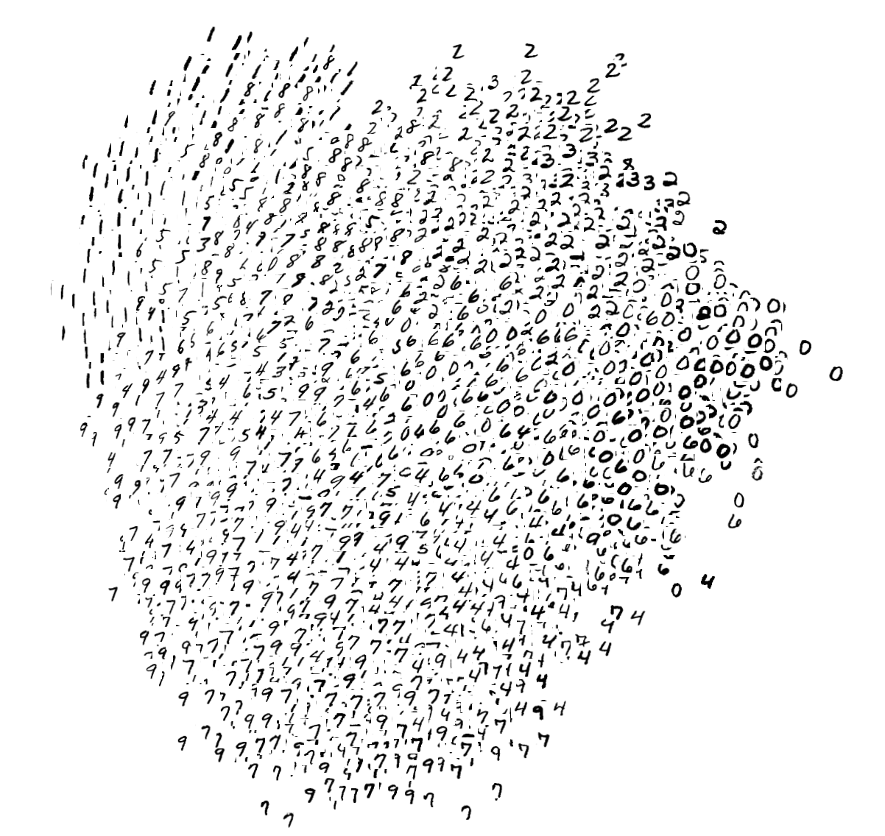
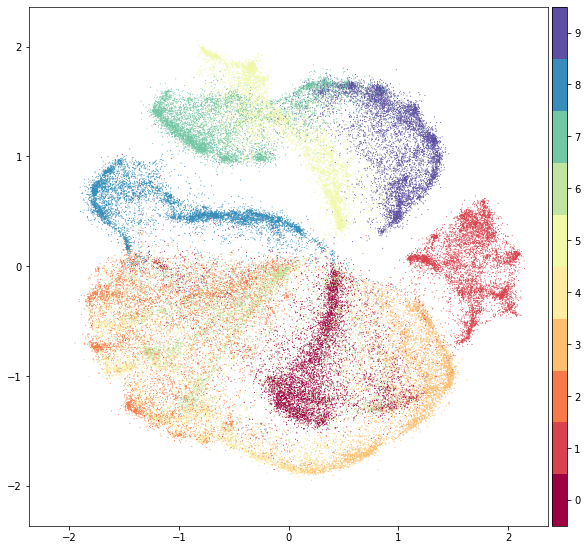

# Team - NAMELESS - 2347233 and 2347263

<details><summary>Table of Contents</summary><p>

* [Why we made Fashion-MNIST](#why-we-made-fashion-mnist)
* [Get the Data](#get-the-data)
* [Usage](#usage)
* [Benchmark](#benchmark)
* [Visualization](#visualization)
* [Contributing](#contributing)
* [Contact](#contact)
* [Citing Fashion-MNIST](#citing-fashion-mnist)
* [License](#license)
</p></details><p></p>


`Fashion-MNIST` is a dataset of [Zalando](https://jobs.zalando.com/tech/)'s article images—consisting of a training set of 60,000 examples and a test set of 10,000 examples. Each example is a 28x28 grayscale image, associated with a label from 10 classes. We intend `Fashion-MNIST` to serve as a direct **drop-in replacement** for the original [MNIST dataset](http://yann.lecun.com/exdb/mnist/) for benchmarking machine learning algorithms. It shares the same image size and structure of training and testing splits.

Here's an example of how the data looks (*each class takes three-rows*):


## Why we made Fashion-MNIST

The original [MNIST dataset](http://yann.lecun.com/exdb/mnist/) contains a lot of handwritten digits. Members of the AI/ML/Data Science community love this dataset and use it as a benchmark to validate their algorithms. In fact, MNIST is often the first dataset researchers try. *"If it doesn't work on MNIST, it **won't work** at all"*, they said. *"Well, if it does work on MNIST, it may still fail on others."* 

### To Serious Machine Learning Researchers

Seriously, we are talking about replacing MNIST. Here are some good reasons:

- **MNIST is too easy.** Convolutional nets can achieve 99.7% on MNIST. Classic machine learning algorithms can also achieve 97% easily. Check out [our side-by-side benchmark for Fashion-MNIST vs. MNIST](http://fashion-mnist.s3-website.eu-central-1.amazonaws.com/), and read "[Most pairs of MNIST digits can be distinguished pretty well by just one pixel](https://gist.github.com/dgrtwo/aaef94ecc6a60cd50322c0054cc04478)."
- **MNIST is overused.** In [this April 2017 Twitter thread](https://twitter.com/goodfellow_ian/status/852591106655043584), Google Brain research scientist and deep learning expert Ian Goodfellow calls for people to move away from MNIST.
- **MNIST can not represent modern CV tasks**, as noted in [this April 2017 Twitter thread](https://twitter.com/fchollet/status/852594987527045120), deep learning expert/Keras author François Chollet.

## Get the Data

[Many ML libraries](#loading-data-with-other-machine-learning-libraries) already include Fashion-MNIST data/API, give it a try!

You can use direct links to download the dataset. The data is stored in the **same** format as the original [MNIST data](http://yann.lecun.com/exdb/mnist/).

| Name  | Content | Examples | Size | Link | MD5 Checksum|
| --- | --- |--- | --- |--- |--- |
| `train-images-idx3-ubyte.gz`  | training set images  | 60,000|26 MBytes | [Download](http://fashion-mnist.s3-website.eu-central-1.amazonaws.com/train-images-idx3-ubyte.gz)|`8d4fb7e6c68d591d4c3dfef9ec88bf0d`|
| `train-labels-idx1-ubyte.gz`  | training set labels  |60,000|29 KBytes | [Download](http://fashion-mnist.s3-website.eu-central-1.amazonaws.com/train-labels-idx1-ubyte.gz)|`25c81989df183df01b3e8a0aad5dffbe`|
| `t10k-images-idx3-ubyte.gz`  | test set images  | 10,000|4.3 MBytes | [Download](http://fashion-mnist.s3-website.eu-central-1.amazonaws.com/t10k-images-idx3-ubyte.gz)|`bef4ecab320f06d8554ea6380940ec79`|
| `t10k-labels-idx1-ubyte.gz`  | test set labels  | 10,000| 5.1 KBytes | [Download](http://fashion-mnist.s3-website.eu-central-1.amazonaws.com/t10k-labels-idx1-ubyte.gz)|`bb300cfdad3c16e7a12a480ee83cd310`|

Alternatively, you can clone this GitHub repository; the dataset appears under `data/fashion`. This repo also contains some scripts for benchmark and visualization.
   
```bash
git clone git@github.com:zalandoresearch/fashion-mnist.git
```

### Labels
Each training and test example is assigned to one of the following labels:

| Label | Description |
| --- | --- |
| 0 | T-shirt/top |
| 1 | Trouser |
| 2 | Pullover |
| 3 | Dress |
| 4 | Coat |
| 5 | Sandal |
| 6 | Shirt |
| 7 | Sneaker |
| 8 | Bag |
| 9 | Ankle boot |

## Usage

### Loading data with Python (requires [NumPy](http://www.numpy.org/))

Use `utils/mnist_reader` in this repo:
```python
import mnist_reader
X_train, y_train = mnist_reader.load_mnist('data/fashion', kind='train')
X_test, y_test = mnist_reader.load_mnist('data/fashion', kind='t10k')
```

### Loading data with Tensorflow
Make sure you have [downloaded the data](#get-the-data) and placed it in `data/fashion`. Otherwise, *Tensorflow will download and use the original MNIST.*

```python
from tensorflow.examples.tutorials.mnist import input_data
data = input_data.read_data_sets('data/fashion')

data.train.next_batch(BATCH_SIZE)
```

Note, Tensorflow supports passing in a source url to the `read_data_sets`. You may use: 
```python
data = input_data.read_data_sets('data/fashion', source_url='http://fashion-mnist.s3-website.eu-central-1.amazonaws.com/')
```

Also, an official Tensorflow tutorial of using `tf.keras`, a high-level API to train Fashion-MNIST [can be found here](https://www.tensorflow.org/tutorials/keras/classification).

### Loading data with other machine learning libraries 
To date, the following libraries have included `Fashion-MNIST` as a built-in dataset. Therefore, you don't need to download `Fashion-MNIST` by yourself. Just follow their API and you are ready to go.

- [Activeloop Hub](https://docs.activeloop.ai/datasets/fashion-mnist-dataset)
- [Apache MXNet Gluon](https://mxnet.apache.org/api/python/docs/api/gluon/data/vision/datasets/index.html#mxnet.gluon.data.vision.datasets.FashionMNIST)
- [TensorFlow.js](https://github.com/tensorflow/tfjs-examples/blob/master/fashion-mnist-vae/data.js)
- [Kaggle](https://www.kaggle.com/zalando-research/fashionmnist)
- [Pytorch](https://pytorch.org/vision/stable/datasets.html#fashion-mnist)
- [Keras](https://keras.io/api/datasets/fashion_mnist/)
- [Edward](http://edwardlib.org/api/observations/fashion_mnist)
- [Tensorflow](https://www.tensorflow.org/api_docs/python/tf/keras/datasets/fashion_mnist)
- [TensorFlow Datasets](https://www.tensorflow.org/datasets/catalog/fashion_mnist)
- [Torch](https://github.com/mingloo/fashion-mnist)
- [JuliaML](https://juliaml.github.io/MLDatasets.jl/latest/datasets/FashionMNIST/)
- [Chainer](https://docs.chainer.org/en/stable/reference/generated/chainer.datasets.get_fashion_mnist.html)
- [HuggingFace Datasets](https://huggingface.co/datasets/fashion_mnist)
 
You are welcome to make pull requests to other open-source machine learning packages, improving their support to `Fashion-MNIST` dataset.

### Loading data with other languages

As one of the Machine Learning community's most popular datasets, MNIST has inspired people to implement loaders in many different languages. You can use these loaders with the `Fashion-MNIST` dataset as well. (Note: may require decompressing first.) To date, we haven't yet tested all of these loaders with Fashion-MNIST.

- [C](https://stackoverflow.com/a/10409376)
- [C++](https://github.com/wichtounet/mnist)
- [Java](https://stackoverflow.com/a/8301949)
- [Python](https://pypi.python.org/pypi/python-mnist) and [this](https://pypi.python.org/pypi/mnist)
- [Scala](http://mxnet.io/tutorials/scala/mnist.html)
- [Go](https://github.com/schuyler/neural-go/blob/master/mnist/mnist.go)
- [C#](https://jamesmccaffrey.wordpress.com/2013/11/23/reading-the-mnist-data-set-with-c/)
- [NodeJS](https://github.com/ApelSYN/mnist_dl) and [this](https://github.com/cazala/mnist)
- [Swift](https://github.com/simonlee2/MNISTKit)
- [R](https://gist.github.com/brendano/39760) and [this](https://github.com/maddin79/darch)
- [Matlab](http://ufldl.stanford.edu/wiki/index.php/Using_the_MNIST_Dataset)
- [Ruby](https://github.com/gbuesing/mnist-ruby-test/blob/master/train/mnist_loader.rb)
- [Rust](https://github.com/AtheMathmo/vision-rs/blob/master/src/fashion_mnist.rs)


## Visualization

### t-SNE on Fashion-MNIST (left) and original MNIST (right) 


### PCA on Fashion-MNIST (left) and original MNIST (right) 


### [UMAP](https://github.com/lmcinnes/umap) on Fashion-MNIST (left) and original MNIST (right) 


### [PyMDE](https://github.com/cvxgrp/pymde) on Fashion-MNIST (left) and original MNIST (right) 



## Contributing

Thanks for your interest in contributing! There are many ways to get involved; start with our [contributor guidelines](/CONTRIBUTING.md) and then check these [open issues](https://github.com/zalandoresearch/fashion-mnist/issues) for specific tasks.

## Contact
To discuss the dataset, please use [](https://gitter.im/fashion-mnist/Lobby?utm_source=share-link&utm_medium=link&utm_campaign=share-link).

## Citing Fashion-MNIST
If you use Fashion-MNIST in a scientific publication, we would appreciate references to the following paper:

**Fashion-MNIST: a Novel Image Dataset for Benchmarking Machine Learning Algorithms. Han Xiao, Kashif Rasul, Roland Vollgraf. [arXiv:1708.07747](http://arxiv.org/abs/1708.07747)**

Biblatex entry:
```latex
@online{xiao2017/online,
  author       = {Han Xiao and Kashif Rasul and Roland Vollgraf},
  title        = {Fashion-MNIST: a Novel Image Dataset for Benchmarking Machine Learning Algorithms},
  date         = {2017-08-28},
  year         = {2017},
  eprintclass  = {cs.LG},
  eprinttype   = {arXiv},
  eprint       = {cs.LG/1708.07747},
}
```

[Who is citing Fashion-MNIST?](https://scholar.google.com/scholar?scisbd=2&q=%22fashion-mnist%22&hl=en&as_sdt=0,5) 

## License

The MIT License (MIT) Copyright © [2017] Zalando SE, https://tech.zalando.com

Permission is hereby granted, free of charge, to any person obtaining a copy of this software and associated documentation files (the “Software”), to deal in the Software without restriction, including without limitation the rights to use, copy, modify, merge, publish, distribute, sublicense, and/or sell copies of the Software, and to permit persons to whom the Software is furnished to do so, subject to the following conditions:

The above copyright notice and this permission notice shall be included in all copies or substantial portions of the Software.

THE SOFTWARE IS PROVIDED “AS IS”, WITHOUT WARRANTY OF ANY KIND, EXPRESS OR IMPLIED, INCLUDING BUT NOT LIMITED TO THE WARRANTIES OF MERCHANTABILITY, FITNESS FOR A PARTICULAR PURPOSE AND NONINFRINGEMENT. IN NO EVENT SHALL THE AUTHORS OR COPYRIGHT HOLDERS BE LIABLE FOR ANY CLAIM, DAMAGES OR OTHER LIABILITY, WHETHER IN AN ACTION OF CONTRACT, TORT OR OTHERWISE, ARISING FROM, OUT OF OR IN CONNECTION WITH THE SOFTWARE OR THE USE OR OTHER DEALINGS IN THE SOFTWARE.
