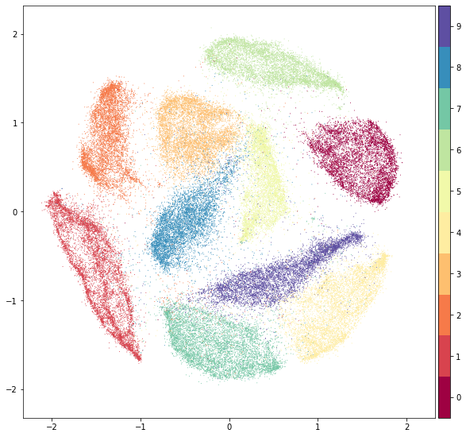

# Team - NAMELESS - 2347233 and 2347263

<details><summary>Table of Contents</summary><p>

* [Why we made Fashion-MNIST](#why-we-made-fashion-mnist)
* [Get the Data](#get-the-data)
* [Usage](#usage)
* [Benchmark](#benchmark)
* [Visualization](#visualization)
* [Contributing](#contributing)
* [Contact](#contact)
* [Citing Fashion-MNIST](#citing-fashion-mnist)
* [License](#license)
</p></details><p></p>


`Fashion-MNIST` is a dataset of [Zalando](https://jobs.zalando.com/tech/)'s article images—consisting of a training set of 60,000 examples and a test set of 10,000 examples. Each example is a 28x28 grayscale image, associated with a label from 10 classes. We intend `Fashion-MNIST` to serve as a direct **drop-in replacement** for the original [MNIST dataset](http://yann.lecun.com/exdb/mnist/) for benchmarking machine learning algorithms. It shares the same image size and structure of training and testing splits.

Here's an example of how the data looks (*each class takes three-rows*):


## Data

| Name  | Content | Examples | Size | Link | MD5 Checksum|
| --- | --- |--- | --- |--- |--- |
| `train-images-idx3-ubyte.gz`  | training set images  | 60,000|26 MBytes | [Download](http://fashion-mnist.s3-website.eu-central-1.amazonaws.com/train-images-idx3-ubyte.gz)|`8d4fb7e6c68d591d4c3dfef9ec88bf0d`|
| `train-labels-idx1-ubyte.gz`  | training set labels  |60,000|29 KBytes | [Download](http://fashion-mnist.s3-website.eu-central-1.amazonaws.com/train-labels-idx1-ubyte.gz)|`25c81989df183df01b3e8a0aad5dffbe`|
| `t10k-images-idx3-ubyte.gz`  | test set images  | 10,000|4.3 MBytes | [Download](http://fashion-mnist.s3-website.eu-central-1.amazonaws.com/t10k-images-idx3-ubyte.gz)|`bef4ecab320f06d8554ea6380940ec79`|
| `t10k-labels-idx1-ubyte.gz`  | test set labels  | 10,000| 5.1 KBytes | [Download](http://fashion-mnist.s3-website.eu-central-1.amazonaws.com/t10k-labels-idx1-ubyte.gz)|`bb300cfdad3c16e7a12a480ee83cd310`|
   
### Labels
Each training and test example is assigned to one of the following labels:

| Label | Description |
| --- | --- |
| 0 | T-shirt/top |
| 1 | Trouser |
| 2 | Pullover |
| 3 | Dress |
| 4 | Coat |
| 5 | Sandal |
| 6 | Shirt |
| 7 | Sneaker |
| 8 | Bag |
| 9 | Ankle boot |

## Usage

### Loading data with Python (requires [NumPy](http://www.numpy.org/))

Use `utils/mnist_reader` :
```python
import mnist_reader
X_train, y_train = mnist_reader.load_mnist('data/fashion', kind='train')
X_test, y_test = mnist_reader.load_mnist('data/fashion', kind='t10k')
```

### Loading data with Tensorflow
Make sure you have [downloaded the data](#get-the-data) and placed it in `data/fashion`. Otherwise, *Tensorflow will download and use the original MNIST.*

```python
from tensorflow.examples.tutorials.mnist import input_data
data = input_data.read_data_sets('data/fashion')

data.train.next_batch(BATCH_SIZE)
```

Note, Tensorflow supports passing in a source url to the `read_data_sets`. You may use: 
```python
data = input_data.read_data_sets('data/fashion', source_url='http://fashion-mnist.s3-website.eu-central-1.amazonaws.com/')
```


## Visualization

### t-SNE on Fashion-MNIST (left) and original MNIST (right) 


### PCA on Fashion-MNIST (left) and original MNIST (right) 


### [UMAP](https://github.com/lmcinnes/umap) on Fashion-MNIST (left) and original MNIST (right) 


### [PyMDE](https://github.com/cvxgrp/pymde) on Fashion-MNIST (left) and original MNIST (right) 

